<p align="center">
  <picture>
    <source media="(prefers-color-scheme: dark)" srcset="docs/inbase-logo-white.png" />
    
  </picture>
</p>

<p align="center">
  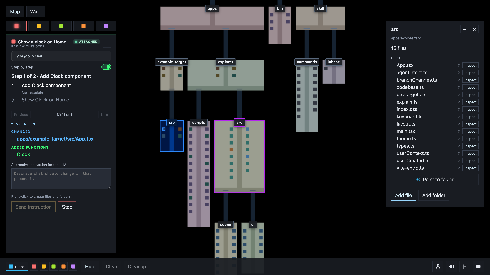
</p>

## Blueprint based development

When an LLM writes code, it takes over decisions about what goes where. You stop building your own mental map of the codebase. The model has it. You do not.

Inbase is a structured way to collaborate with an LLM. It visualizes the codebase as a map. Every step the model takes updates that visualization, so the new mental map is in front of you each time. You see what went where. That cuts AI brain-fry and skill degradation.

You draw the intended change on a map of the real codebase before the model writes a file. That drawing is a **blueprint**: planned files, folders, functions, variables, imports, notes, and pointers, laid on the existing code. The LLM must follow that layout.

The model reads the blueprint, says what it sees (`I see on the blueprint ...`) so you can confirm the reading, reports a plan that matches it, and **stops**. You run the work from Cursor, Claude Code, Codex, Copilot, or Cline with `/accept`, one map change per command. Inbase records each one as a patch on the map. If a proposal is wrong, type the change in the attached chat (that replaces the waiting proposal), change the blueprint, or Stop.

Blueprints have two layers:

- **Global (blue):** shared by every chat. Put structure here that every session should follow.
- **Session (coral, amber, lime, orange, violet):** local to one chat. Put the work for that chat here.

Planned files stay on the map after they exist on disk. Hide a color with its chip, or clear or clean them up when you are done. When a session finishes, Inbase discards its slot and opens a new empty one. The global blueprint stays.

Inbase does not call a model. The coding loop works in **Cursor**, **Claude Code**, **Codex**, **GitHub Copilot**, and **Cline**. `inbase init` installs a skill so the agent uses the map instead of editing files on its own.

---

## Support overview

The map draws every text file. Hidden files (names starting with `.`) stay off the map until you turn on **Show hidden files**. Colors, relations, structure, and editor install are plug-in modules.

| | Today | Fallback | Add more |
| --- | --- | --- | --- |
| Colors | JS, TS, CSS, SCSS, JSON, HTML | Dark grey | `apps/explorer/src/file-colors.ts` |
| Relations | ESM `import`, `require()`, HTML `<script src>` | Packages and remote URLs | `apps/explorer/scripts/relations/` |
| Structure | Functions, classes, vars in JS/TS | Block with no cubes | `apps/explorer/scripts/structure/` |
| Editors | Cursor, Claude Code, Codex, Copilot, Cline (`inbase init`) | Map still runs in the browser | `bin/editors/` |

Relative import specifiers become edges when they resolve on disk. `inbase init` copies editor skills and slash commands.

---

## Manual

Keep `inbase run` open while you work. Language colors, import analyzers, and editor install are summarized in [Support overview](#support-overview).

1. [Install and start](#install-and-start)
2. [Config](#config)
3. [The map](#the-map)
4. [Sessions and colors](#sessions-and-colors)
5. [Drawing a blueprint](#drawing-a-blueprint)
6. [Connecting a chat](#connecting-a-chat)
7. [The plan and `/accept` loop](#the-plan-and-accept-loop)
8. [Step by step vs full plan](#step-by-step-vs-full-plan)
9. [Explain mode](#explain-mode)
10. [Reviewing changes](#reviewing-changes)
11. [Branch changes](#branch-changes)
12. [Controls](#controls)
13. [Commands](#commands)
14. [Language support](#language-support)

### Install and start

The npm package is `@jkwd/inbase` (npm blocks the unscoped name `inbase`). The command name is `inbase`.

```bash
npm install -D @jkwd/inbase
npx inbase init
npx inbase run
```

Or install globally:

```bash
npm install -g @jkwd/inbase
inbase init
inbase run
```

Open the printed URL (http://127.0.0.1:5173 by default). In a Cursor or VS Code terminal, **Cmd+click** the link (Ctrl+click on Windows/Linux) to open it in the editor. Hover the URL to see the prompt. You can also paste the URL into an external browser.

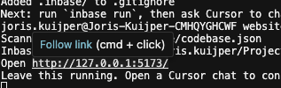

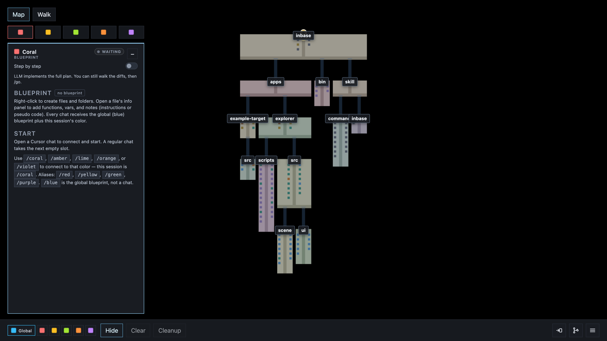

`inbase run` maps `target` from `inbase.json` when that file is present, otherwise the current directory. To map another folder for one run:

```bash
inbase run --target /path/to/your/project
```

`inbase init` copies a Cursor skill into `.cursor/skills/inbase/`, a Claude Code skill into `.claude/skills/inbase/`, shared Agent Skills into `.agents/skills/`, Copilot skills into `.github/skills/`, Cline skills into `.cline/skills/inbase/` and `.cline/SKILL.md`, Cline workflows into `.cline/workflows/`, Cline rules into `.cline/rules/inbase.md` and a root `.clinerules` file, writes `inbase.json` if it is missing, and gitignores `.inbase/`. Keep `inbase run` open, then ask the agent to change source files. The LLM follows the visual plan and patch loop below.

### Config

Commit an `inbase.json` next to where you run `inbase`. CLI flags and env vars still win: **CLI > env > `inbase.json` > defaults**. `target` is resolved from the config file's directory.

```json
{
  "target": ".",
  "port": 5173,
  "ignore": [],
  "stepByStep": false
}
```

| Setting | What it does |
| --- | --- |
| `target` | Folder the map scans. Use a subfolder in a monorepo, like `"apps/web"`. |
| `port` | Dev server port. Same as `--port`. |
| `ignore` | Extra gitignore-style patterns on top of `.gitignore` and the built-in `node_modules` / `dist` skip list. |
| `stepByStep` | Default for new sessions. `false` implements the full plan; `true` waits for `/accept` between steps. |

Runtime data stays in `.inbase/` (gitignored). Do not put session or camera state in `inbase.json`.

### The map

The map is top-down.

- **Scroll:** zoom
- **Drag:** pan
- **Click** a file for info, or a folder for its files
- **Right-click** to create a file or folder, or to point at a folder
- **Option-click** a folder to enter Walk there
- The **gold pin** is your Walk position
- **Hidden files** are off by default; press **H** or use the HUD toggle to show them

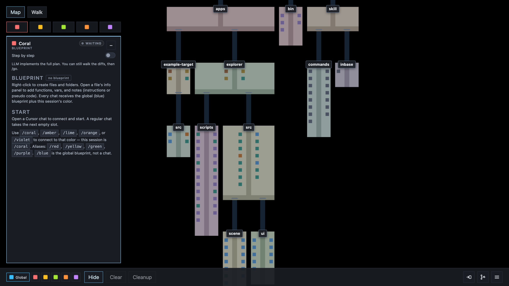

Reading the map:

- Each **file** is a block. Taller blocks have more lines of code.
- Small cubes on a block are **functions** (blue) and **variables** (tan).
- Each **folder** is an area with a center path.
- At the far end of an area, **bridges** lead into child folders. The folder name hangs above the bridge.
- Click a block to see **import relations**. Connected files stay lit and arcs draw to them. Press **K** to flip between imports and imported-by.

**Update model** rescans files and folders after the tree has changed outside the LLM loop.

**Walk** is an optional first-person view of the same map. Switch with the **Map** / **Walk** buttons, or press **M**. Click the scene to capture the mouse.

- **WASD:** walk
- **Mouse:** look around
- **Shift:** sprint
- **Click** an aimed import line to fly along it
- **Double-click** a file or folder for its info panel
- **Double-click** or **Esc:** release the mouse

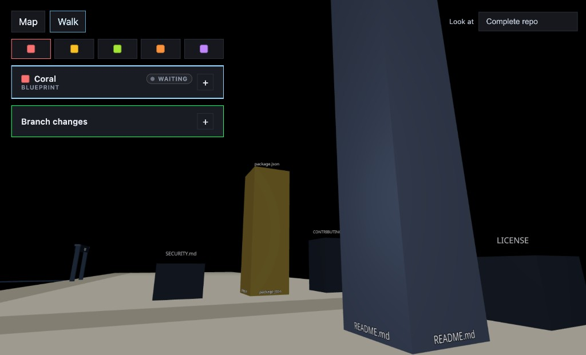

### Sessions and colors

`npx inbase run` opens **5 empty chat slots** on the map. Each slot has a color:

| Color | Command | Alias |
| --- | --- | --- |
| Coral | `/coral` | `/red` |
| Amber | `/amber` | `/yellow` |
| Lime | `/lime` | `/green` |
| Orange | `/orange` | |
| Violet | `/violet` | `/purple` |

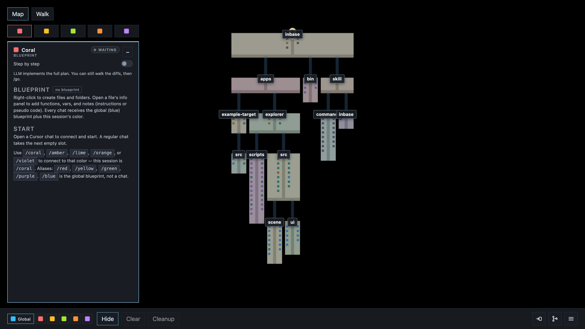

`/blue` selects the global blueprint. There is no Blue LLM session.

A regular chat connects to the next unconnected slot (oldest first). Inbase skips sessions that have an LLM. The map window does not need focus. The cap is 5 connected chats.

Type `/coral` (or another color) to skip the queue and attach to that slot. With no text after the command, the agent starts from the enabled blueprint only: create those files and structure, and ask if it needs more information. Add a request after the command, like `/coral add a login page`, when you want extra instruction.

When a session finishes, Inbase discards it and opens a new empty slot. The global blueprint stays. Restarting the visualizer discards leftover sessions and opens 5 new empty slots.

Use `/skipinbase [request]` to work outside the map. If Inbase is not running, start it with `npx inbase run`.

### Drawing a blueprint

The blueprint is the spatial plan the LLM must follow. Draw it before a chat connects, or keep placing after the chat has attached.

Pick colors with the chips at the bottom of the HUD. **Global** (blue) is shared across sessions. A session color is local to that chat. Selected colors stay visible; click a selected chip to hide it, and click again to show it. New files go on the last color you selected. Clear and cleanup apply to every selected color.

Right-click the map to create a file or folder on the selected blueprint, or to point at a folder.

Open a file's **info panel** (double-click in walk, click in map) to add **functions**, **vars**, and **imports**. Add a **file note** or a symbol note for extra instructions or pseudo code.

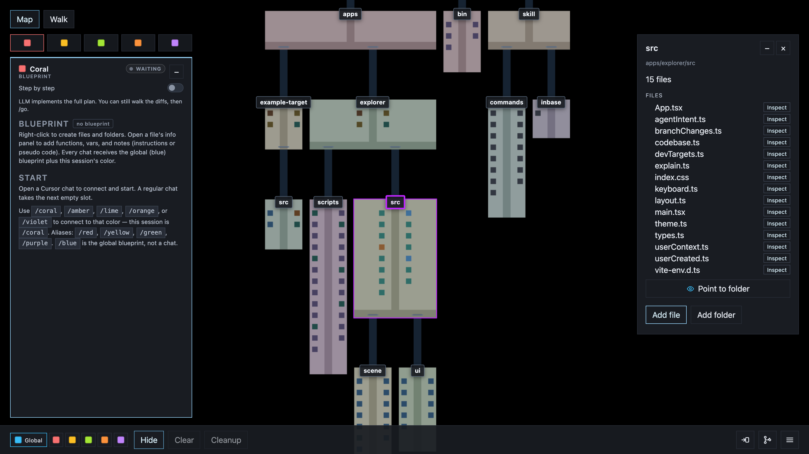

**Point to** a file, folder, or function to keep it in mind for that color. Pointers travel with the blueprint the chat receives.

To capture an existing area as a blueprint, type **`/extract-blueprint [folder] [output file]`** in chat, or run `inbase extract-blueprint <folder> <output-file>`. The agent scans the folder, then keeps only the architecture that belongs on a blueprint: important folders, files, functions, vars, and notes. It does not dump the whole tree.

The LLM treats an enabled blueprint as leading. It creates those paths and symbols, including ones that are not on disk yet. The agent may edit existing files when the feature needs them. Extra new files that are not in the blueprint are a deviation. The agent must ask before it reports a plan that differs.

Each color has two controls besides the chip:

- **Clear:** remove every planned file, folder, and symbol on this color.
- **Cleanup:** drop blueprint files and folders that exist on disk. Planned items that are missing stay.

The hamburger **More** menu has **Save blueprint**, **Save blueprint as**, and **Load blueprint**. Save writes the current global and session-colored layers into a `blueprints/` folder at the project root (created on first save). Name the blueprint, then save. Save as writes the same file to another folder. Load lists saved blueprints from that folder; **Choose file…** loads one from somewhere else. Saved blueprints are skipped on the map scan so they do not appear as files.

### Connecting a chat

<p>
  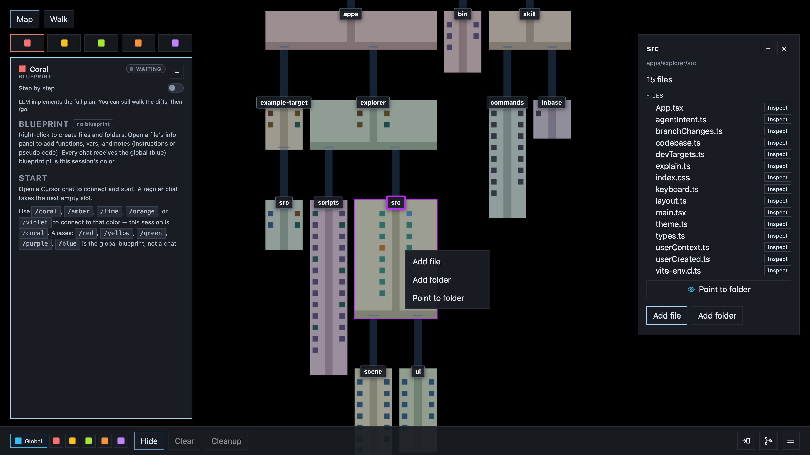
  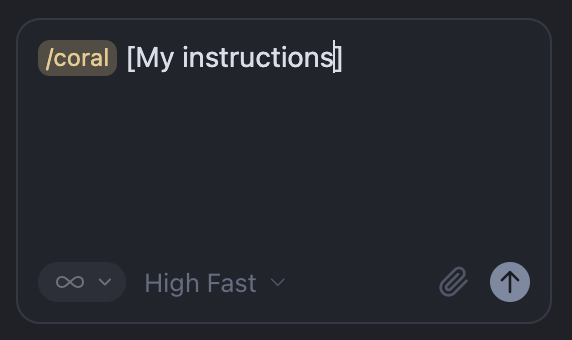
</p>

1. Draw a blueprint, then open a Cursor, Claude Code, Codex, Copilot, or Cline chat. Skip the drawing if the chat request is enough.
2. Type `/coral` (or another color) to connect. That is enough when a blueprint is already on the map. Add a request after the command, like `/coral add a settings page`, when you want extra instruction.
3. The chat attaches to a slot. The HUD shows **LLM connected** on that color.
4. The agent reads the global blueprint, that session's local blueprint, and any request. It says what it sees (`I see on the blueprint ...`) so you can confirm the reading. With no request, it plans only from the blueprint: create those files and structure. It can ask if it needs more information.
5. It **stops**. The plan waits for `/accept`.

The chat request does not override an enabled blueprint. If they conflict, the agent asks before planning.

You do not pass a session id or run CLI session commands. The skill does that. If attach fails because Inbase is not running, start it and send the request again.

### The plan and `/accept` loop

The HUD lists every plan step. With **Step by step** off (the default), the LLM implements the full plan. You can walk **Previous** / **Next** over the diffs; `/accept` on the last proposal finishes the session.

With **Step by step** on:

1. Type **`/accept`** in the attached chat to start the waiting step.
2. The LLM edits live project files for **that step only**, then records a patch. Those stored patches are the session record.
3. The HUD shows the proposal: added, changed, and removed files, plus functions, vars, and imports. Type **`/accept`** again to accept it.
4. After accept, the agent stops. Type **`/accept`** again to start the next step. The last proposal needs `/accept` to finish.
5. After the last recorded patch you can `/accept`, type a change in the same chat to replace that last step, or **Stop**. Do not start a new chat to update the work.

<p>
  
  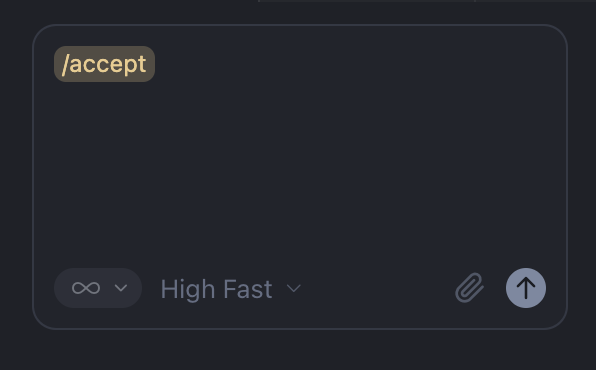
</p>

While a proposal is waiting:

- Type the change in the **same** attached chat to **replace** that proposal. The agent updates the plan from that last step (for example steps A, B, C waiting on C → keep A and B, replace C with one or more new remaining steps), then records a new proposal. Do not `/accept` just to finish the session so you can start over. Do not open a new chat.
- Type **`/explain`** to walk what has changed in the current proposal on the map instead of accepting it.
- **Stop** ends the session.


With **Step by step** on, the agent waits after each proposal. You sequence the work with plan, `/accept`, review, `/accept`.

### Step by step vs full plan

The **Step by step** switch lives on the session panel. New sessions start with it off.

- **Off (default):** the LLM implements the full plan. You can walk **Previous** / **Next** over the diffs. `/accept` on the last proposal finishes the session.
- **On:** `/accept` starts one step, then pauses on the proposal. Another `/accept` accepts it. Another starts the next step.

Turn the switch before the plan runs. You accept or finish the work yourself, including when the model writes every step in one pass.

### Explain mode

Explain mode walks a question on the map. It does not edit project files or start the next plan step.

**From a question**

Type `/explain How does login work?` while the map is open. The HUD hides and an **X** exits. The LLM publishes an explanation you step through in the overlay.

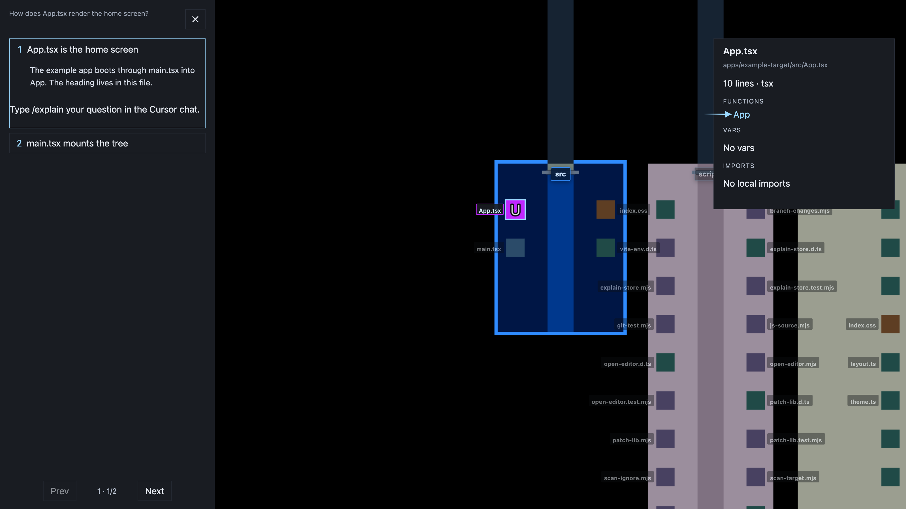

**From a proposal**

If a plan or proposal is waiting, `/explain` with no question explains **what has changed in that proposal**. Add a question for extra focus.

**From a git diff**

When **Show branch changes** is on, `/explain` with no question explains **what has changed in this diff**. Add a question for extra focus.

**From a `?` click**

Click the **?** next to a file or folder name, then type `/explain` in the chat. The LLM explains that path and where it fits.

**On the overlay**

- Each step can dim the rest of the map, select a block to show import relations, and zoom into a folder.
- A step can open the file **info panel**, highlight functions and vars, and draw an arrow that points at a symbol.
- Type `/explain` with a follow-up question to drill into sub-steps (`7.1`, `7.2`) until you return to the next original step.
- Arrow keys or the step list move through the explanation.

Close with **X**. Type `/accept` to continue the plan.

### Reviewing changes

Every recorded patch is a step on the session chain.

- **Previous** / **Next** walk the diffs without accepting them.
- The session panel lists changed, added, and removed files, plus functions, vars, and imports for the current diff.
- The map highlights those files. Press **C** to show only changed paths.
- Click a highlighted block to see which functions and vars that patch added or edited.
- Type **`/explain`** with no question to walk what has changed in the current diff.

Inbase stores patches under `.inbase/` and applies them on every step update. You do not write unified diffs.

### Branch changes

When no LLM is making changes, turn on **Show branch changes** (or press **G**) to highlight the current git branch against its base: committed, unstaged, and untracked files, in place of LLM patch files. Type **`/explain`** with no question to walk what has changed in that diff.

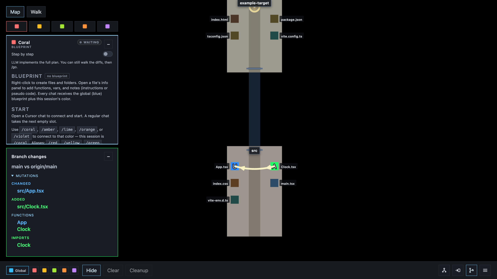

Inbase disables this control while an LLM session is writing or reviewing a patch.

### Controls

| Action | Walk | Map |
| --- | --- | --- |
| Walk / look | WASD, mouse, Shift | |
| Switch view | M | M |
| File info | Double-click | Click |
| Import relations | Click a block | Click a block |
| Imports / imported-by | K | K |
| Fly along a line | Click the aimed line | |
| Walk into a folder | | Option-click |
| Place file or folder | | Right-click |
| Point to a target | Point to | Right-click, Point to folder |
| Save / load blueprint | More menu | same |
| Show only changed paths | | C |
| Hidden files | H | H |
| Branch changes | G | G |
| Release mouse | Double-click, Esc | |
| Connect a chat | Chat, or `/coral` `/amber` `/lime` `/orange` `/violet` | same |
| Start or continue a step | `/accept` in that chat | |
| Explain | `/explain` in chat, or `?` then `/explain` | same |
| Skip the map | `/skipinbase` | |
| Extract a blueprint | `/extract-blueprint` | |

The in-app **Instructions** overlay (bottom of the HUD) lists the same controls for the view you are in.

---

## Commands

| Command | What it does |
| --- | --- |
| `inbase init` | Install Cursor, Claude Code, Codex, Copilot, and Cline skills in this repo and write `inbase.json` if missing |
| `inbase run` | Scan this repo and start the local map |
| `inbase run --port 5174` | Start on another port |
| `inbase run --target <dir>` | Map another folder |
| `inbase accept [--session <id>]` | Start the waiting step, or accept a ready proposal (`/accept`). The last proposal still needs this to finish |
| `inbase explain start [--question "..."]` | Open map-only explain mode. Omit `--question` to explain the current proposal or git diff |
| `inbase explain report --step "..."` | Publish explanation steps and map focus |
| `inbase explain stop` | Exit explain mode |
| `inbase extract-blueprint <folder> <file>` | Scan a folder and print an inventory for `/extract-blueprint`. `--write` saves the curated blueprint |

The installed skill runs session commands (`attach`, `read-blueprint`, `report-plan`, `accept`, `propose-patch`, `explain`, `extract-blueprint`). You do not need to run them.

## Editor support

The map runs in the browser. The LLM plan and patch loop works in **Cursor**, **Claude Code**, **Codex**, **GitHub Copilot**, and **Cline**. `inbase init` uses the editor adapters in `bin/editors/` to install the skill and slash commands. Cursor and Claude Code get command files (`/accept`). Codex, Copilot, Gemini CLI, and other SKILL.md agents get skill folders in `.agents/skills/` (`.github/skills/` for Copilot). Cline gets `SKILL.md` where its scanner looks (`.cline/skills/inbase/` and `.cline/SKILL.md`), an always-on rule as both `.cline/rules/inbase.md` and a root `.clinerules` file, plus slash-command workflows in `.cline/workflows/`. Those Cline files use `execute_command` XML so the model runs `npx inbase` instead of printing it. In Copilot or Cline chat type `/accept`; in Codex use `$accept` or `/skills`. Other editors can be added as adapters there.

## Language support

Inbase draws every text file in the project as a block. Unknown extensions use the default dark grey. JavaScript and TypeScript also get **functions**, **classes**, and **variables** from the structure analyzer. Relation analyzers turn relative ESM `import`s, `require()` calls, and HTML `<script src>` into edges when they resolve, including `.astro` and other JS-style modules. Package names like `react` or `@angular/core` do not. Binary files are skipped. See [Support overview](#support-overview).

## Develop Inbase itself

This repository is a workspace. The bundled demo target is `apps/example-target`.

```bash
npm install
npm run dev
```

`npm run dev` maps `apps/example-target` by default (`inbase.json`). In the map, **Look at** switches to the complete repository (and later example apps). That control exists in `npm run dev`, not in `inbase run`.

To map a different project without the CLI:

```bash
VISUAL_CODER_TARGET=/path/to/your/project npm run dev
```

To run the example React app:

```bash
npm run dev:target
```

## Contributing

Issues and pull requests are welcome. See [CONTRIBUTING.md](CONTRIBUTING.md).

## License

Inbase is open source under the [MIT License](LICENSE).
