<p align="center">
  <picture>
    <source media="(prefers-color-scheme: dark)" srcset="docs/inbase-logo-white.png" />
    
  </picture>
</p>

<p align="center">
  
</p>

## Blueprint based development

When an LLM writes code, it takes over the mental map of the codebase. You lose track of what went where, you lose the mantal map of the codebase.

Inbase puts that map in front of you. You draw the intended change as a **blueprint** on a visualization of the real code — planned files, folders, functions, variables, imports, and notes. The LLM must follow that layout. Every step updates the map, so you see the new structure as it lands.


---

## Support overview

| | Today | Fallback | Add more |
| --- | --- | --- | --- |
| Colors | JS/JSX/MJS/CJS, TS/TSX, CSS, SCSS, JSON, HTML/HTM | Dark grey | `apps/explorer/src/file-colors.ts` |
| Relations | ESM `import`, `require()`, HTML `<script src>` | Packages and remote URLs | `apps/explorer/scripts/relations/` |
| Structure | Functions, classes, vars in JS/TS (info panel) | No symbols listed | `apps/explorer/scripts/structure/` |
| Editors | Cursor, Claude Code, Codex, Copilot, Cline (`inbase init`) | Map still runs in the browser | `bin/editors/` |

---

## Manual

Keep `inbase run` open while you work.

1. [Install and start](#install-and-start)
2. [Using the map](#using-the-map)
3. [LLM interaction](#llm-interaction)
4. [Starting a LLM session](#starting-a-llm-session)
5. [Walk mode](#walk-mode)
6. [Explain mode](#explain-mode)
7. [InBase cli](#inbase-cli)

### Install and start

The npm package is `@jkwd/inbase`.

Local install:

```bash
npm install -D @jkwd/inbase     # add the package
npx inbase init <editor>        # install editor skills + inbase.json
npx inbase run                  # start the map

# <editor> is optional: one editor only (cursor, claude, agents, copilot, cline)
```

Or global:

```bash
npm install -g @jkwd/inbase   # add the package
inbase init <editor>          # install editor skills + inbase.json
inbase run                    # start the map

# <editor> is optional: one editor only (cursor, claude, agents, copilot, cline)
```

Open the printed URL (http://127.0.0.1:5173 by default). **Ctrl+click** the link in the terminal (Cmd+click on macOS) to open the InBase UI inside your editor.

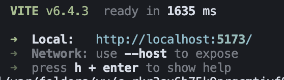

Or paste the URL into a separate browser — useful on a dual-screen or ultrawide setup.

#### Config

Commit an `inbase.json` next to where you run `inbase`. CLI flags and env vars still win: **CLI > env > `inbase.json` > defaults**. `target` is resolved from the config file's directory.

```json
{
  "target": ".",
  "port": 5173,
  "ignore": []
}
```

| Setting | What it does |
| --- | --- |
| `target` | Folder the map scans. Use a subfolder in a monorepo, like `"apps/web"`. The skill only connects a color session for file changes inside this folder. |
| `port` | Dev server port. Same as `--port`. |
| `ignore` | Extra gitignore-style patterns on top of `.gitignore` and the built-in `node_modules` / `dist` skip list. |

Runtime data stays in `.inbase/` (gitignored). Do not put session or camera state in `inbase.json`.

### Using the map

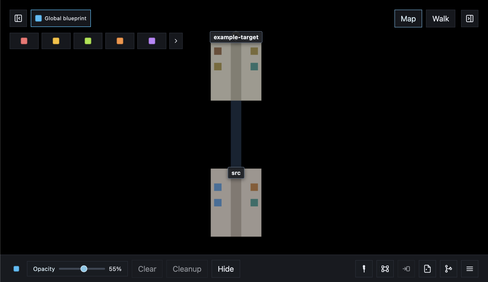

The map is top-down.

- **Scroll:** zoom
- **Drag:** pan
- **Click** a file for info, or a folder for its files
- **Right-click** a folder to create a file or folder, or to point at it; right-click a file to open or explain it
- **Option-click** (or drag the person onto the map) to Walk there
- The **gold pin** is your Walk position
- **Hidden files** are off by default; press **H** or use the HUD toggle to show them

Reading the map:

- Each **file** is a block. Taller blocks have more lines of code.
- Click a block (or press **I**) to open the **info panel** — functions, variables, and imports live there, not on the block itself.
- Each **folder** is an area with a center path.
- At the far end of an area, **bridges** lead into child folders. The folder name hangs above the bridge.
- Click a block to see **import relations**. Connected files stay lit and arcs draw to them. Press **K** to flip between imports and imported-by.

**More → Update model** rescans files and folders after the tree has changed outside the LLM loop.

#### Controls

| Action | Control |
| --- | --- |
| Zoom / pan | Scroll, drag |
| File info | Click, I |
| Import relations | Click a block |
| Imports / imported-by | K |
| Switch to Walk | M |
| Walk onto the map | Option-click, or drag the person |
| Place file or folder | Right-click a folder |
| Open or explain a file | Right-click a file |
| Point to a target | Right-click, Point to folder |
| Save / load / rescan | More menu |
| Show only changed paths | C |
| Hidden files | H |
| Connect a chat | Chat, or `/coral` `/amber` `/lime` `/orange` `/violet` `/teal` `/crimson` `/forest` `/grey` `/white` |
| Keep the work and free the color | **Done** in the session window |
| Explain | `/explainit` in chat, or `?` then `/explainit` |
| Extract a blueprint | `/extract-blueprint` |

The in-app **Instructions** overlay (bottom of the HUD) lists the same controls for the view you are in.

### LLM interaction

#### Sessions and colors

`npx inbase run` opens **10 empty chat slots** on the map. Each slot has a color.


| Color | Command | Alias |
| --- | --- | --- |
| Coral | `/coral` | `/red` |
| Amber | `/amber` | `/yellow` |
| Lime | `/lime` | `/green` |
| Orange | `/orange` | |
| Violet | `/violet` | `/purple` |
| Teal | `/teal` | |
| Crimson | `/crimson` | |
| Forest | `/forest` | `/darkgreen` |
| Grey | `/grey` | `/gray` |
| White | `/white` | |

Connect a regular chat by starting with a color command and your request:

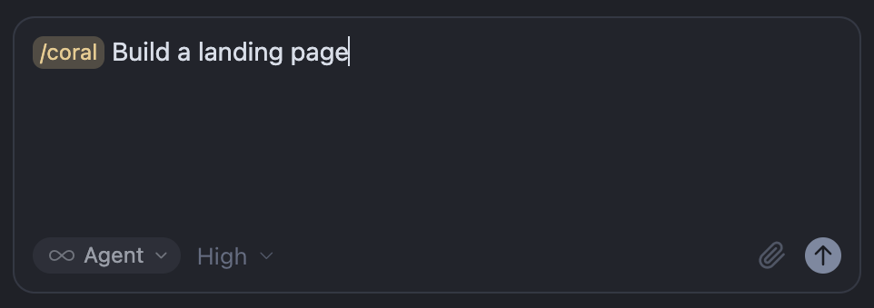

That attaches the chat to that color’s empty slot — Coral in the example above.

If you skip the command and only send the request, Inbase attaches the **first available** color instead:

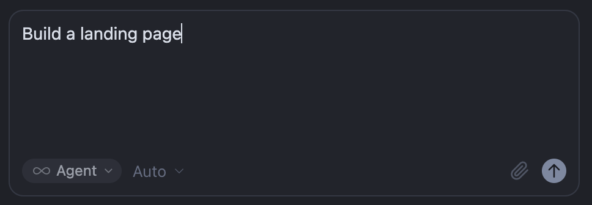

When a chat is attached, the map opens that color’s **LLM session window**. Look for **ATTACHED** / **LLM CONNECTED** and the current status (for example “LLM is drafting the plan”):


There is no `/blue` command: blue is not a chat slot. It is the **global blueprint**, shared by every LLM session — covered in the next section.

#### Drawing a blueprint

You draw a blueprint **on top of the map** — the spatial plan the LLM must follow. Place it before a chat connects, or keep adding after the chat has attached.

Pick a session color in the row above the session window to draw on that color’s local blueprint. **Global blueprint** (next to the fold-in control) draws on the shared blue layer and hides the session window. Hide, Clear, and Cleanup apply to the active color.

##### Add folders

Right-click a folder on the map and choose **Add folder**. For example, plan a `components` folder under `src`:

1. Open the context menu and choose **Add folder**:

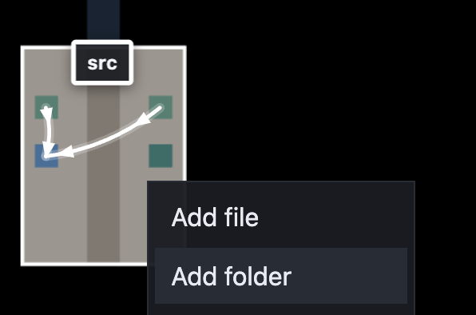

2. Enter the name and choose which blueprint it belongs to — **Global** or a session color:

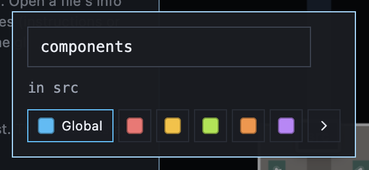

3. The planned folder appears on the map (blue when it is on the global blueprint):


##### Add files

Right-click a folder and choose **Add file**. For example, `RandomColorGenerator.tsx` inside `components`:

1. Open the context menu and choose **Add file**:


2. Enter the file name (it is created in that folder on the active blueprint):


3. The file block appears on the map. Click it to open the **info panel**:

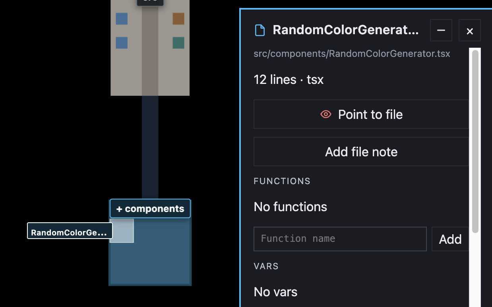

##### Add function and vars

In the info panel, add the **functions** and **vars** the file should contain. Type a name and click **Add** — the LLM treats those symbols as part of the blueprint:

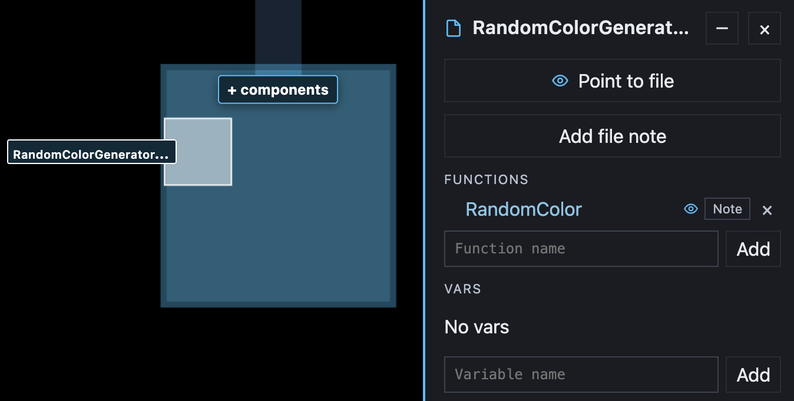

You can also add **imports**, or a note on a symbol for extra instructions or pseudo code.

##### File notes

Use a **file note** for free-form instructions the LLM should follow for that file. In the info panel, click **Add file note**:

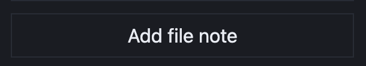

Write what the file should do, then close the note:

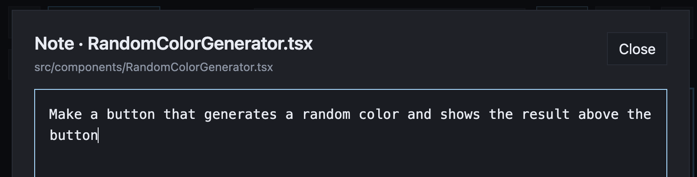

##### Session specific blueprint

**Blue** is always the **global** blueprint — every LLM session sees it. The other colors are **session-specific**: only the chat attached to that color receives that layer.

When you add a folder or file, pick **Global** or a session color at the bottom of the dialog:

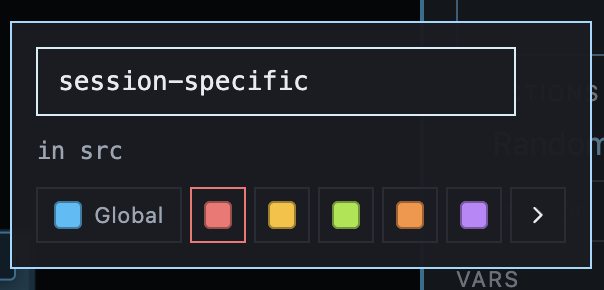

Planned items take that color on the map. Here `components` is global (blue) and `session-specific` belongs to Coral (red):

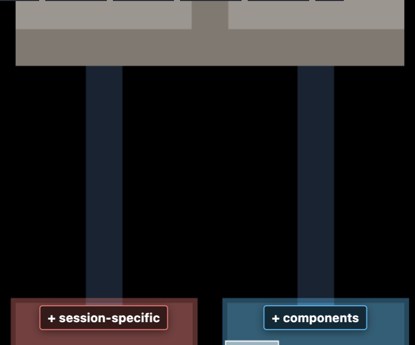


Left to right: the first folder is local to `/coral`, the second is local to `/amber`, and the blue folder is the **global** blueprint — shared with both LLM sessions.

### Starting a LLM session

When you start an LLM session — for example `/coral build a random color generator component` — the chat attaches to that color and the session window opens on the map:

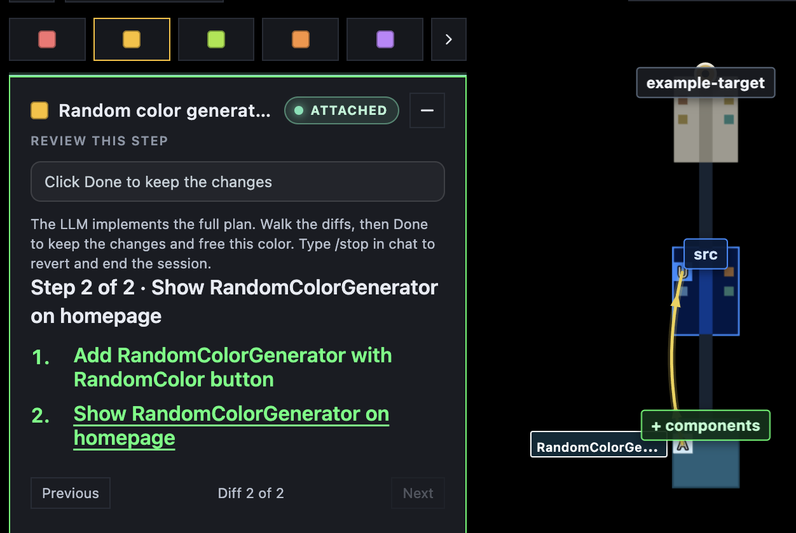

The LLM lists the steps it will take to reach the goal. Each step is visualized on the map so you can see what changed.

You can keep chatting in the same thread to steer the work in a different direction whenever you want.

When the work is applied, click **Clear** to remove the blueprint overlay. The new files stay on the map:

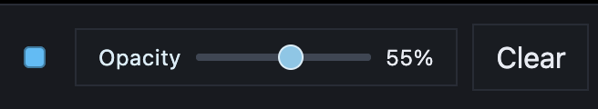

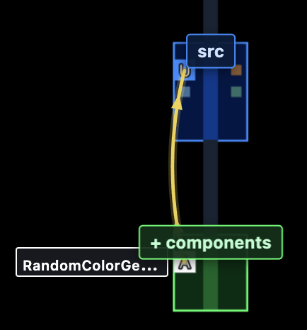

### Walk mode

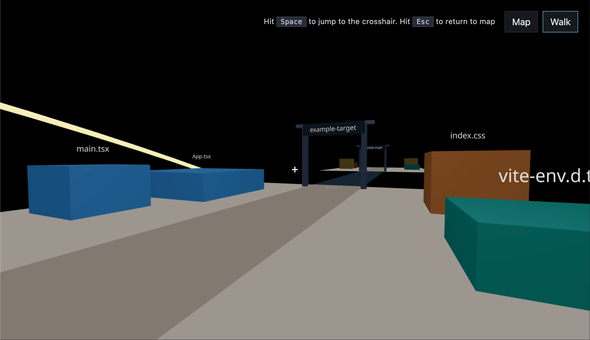

**Walk** is a first-person view of the same map. Switch with the **Map** / **Walk** buttons, or press **M**. Click the scene to capture the mouse. On the map, option-click where you want to land, or drag the person onto the map.

#### Controls

| Action | Control |
| --- | --- |
| Walk | WASD |
| Look | Mouse |
| Sprint | Shift |
| Jump to crosshair | Space |
| Switch to Map | M, Esc |
| Release mouse | Double-click |
| File info | I |
| Imports / imported-by | K |
| Point to a target | Point to |
| Hidden files | H |

### Explain mode

Explain mode walks a question on the map. It does not edit project files or start the next plan step.

**From a question**

Type `/explainit` with a question while the map is open — for example the main structure of the codebase:


The HUD hides and an **X** exits. The LLM publishes an explanation you step through in the overlay. Each step can focus a folder or file on the map:

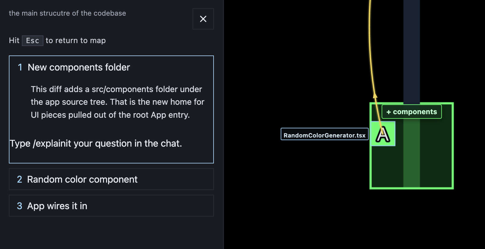

A later step can open the file **info panel**, highlight functions and vars, and draw arrows to the symbols it names:


### InBase cli

The command name is `inbase` (via `npx inbase` or a global install). Run `inbase help` for the same overview in the terminal.

#### Project commands

| Command | What it does |
| --- | --- |
| `inbase init` | Install Cursor, Claude Code, Codex, Copilot, and Cline skills; write `inbase.json` if missing; gitignore `.inbase/` |
| `inbase init <editor>` | Install only that editor (`cursor`, `claude`, `agents`, `copilot`, `cline`) |
| `inbase cleanup` | Remove installed skills and rules, `.inbase/`, `inbase.json`, and the `.gitignore` entry |
| `inbase cleanup <editor>` | Remove only that editor's skills |
| `inbase run` | Scan the project and start the local map. Maps `target` from `inbase.json`, else the current directory. If a map is already running, prints the URL and exits |
| `inbase run --target <dir>` | Map another folder for this run |
| `inbase run --port <number>` | Start on another port (default: `inbase.json` port, else 5173) |
| `inbase extract-blueprint <folder> <file>` | Scan a folder and print an inventory for `/extract-blueprint`. `--write` saves the curated blueprint |
| `inbase help` | Show CLI help |

---

## Contributing

Issues and pull requests are welcome. See [CONTRIBUTING.md](CONTRIBUTING.md).

## License

Inbase is open source under the [MIT License](LICENSE).
