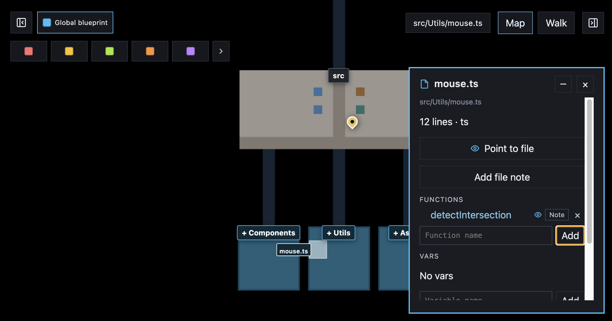

  <picture>
    <source media="(prefers-color-scheme: dark)" srcset="docs/images/inbase-logo-white.png" />
    
  </picture>

  

## Blueprint-driven development

When an LLM writes code, it takes over the mental map of the codebase. You lose track of what went where, you lose the mantal map of the codebase.

Inbase puts that map in front of you. You draw the intended change as a **blueprint** on a visualization of the real code — planned files, folders, functions, variables, imports, and notes. The LLM must follow that layout. Every step updates the map, so you see the new structure as it lands.

---

## Support overview

| | Today | Fallback | Add more |
| --- | --- | --- | --- |
| Colors | JS/JSX/MJS/CJS, TS/TSX, CSS, SCSS, JSON, HTML/HTM | Dark grey | `apps/explorer/src/file-colors.ts` |
| Relations | ESM `import`, `require()`, HTML `<script src>` | Packages and remote URLs | `apps/explorer/scripts/relations/` |
| Structure | Functions, classes, vars in JS/TS (info panel) | No symbols listed | `apps/explorer/scripts/structure/` |
| Editors | Cursor, Claude Code, Codex, Zed, Copilot, Cline, OpenCode (`inbase init`) | Map still runs in the browser | `bin/editors/` |

---

## Manual

Keep `inbase run` open while you work.

1. [Install and start](docs/install-and-start.md)
2. [Using the map](docs/using-the-map.md)
3. [LLM interaction](docs/llm-interaction.md)
4. [Starting a LLM session](docs/starting-a-llm-session.md)
5. [Walk mode](docs/walk-mode.md)
6. [Explain mode](docs/explain-mode.md)
7. [InBase cli](docs/inbase-cli.md)

---

## Contributing

Issues and pull requests are welcome. See [CONTRIBUTING.md](CONTRIBUTING.md).

## License

Inbase is open source under the [MIT License](LICENSE).
