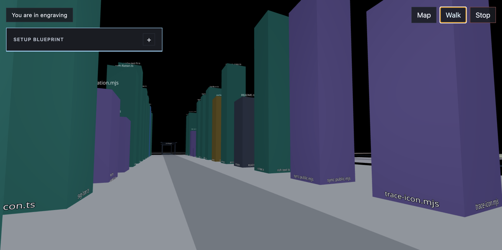
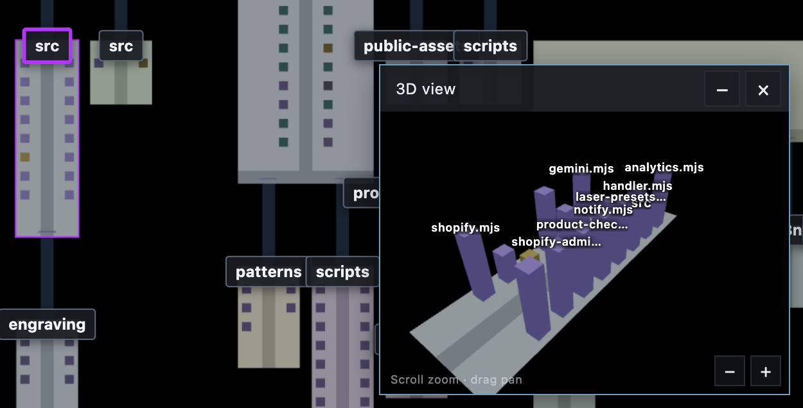
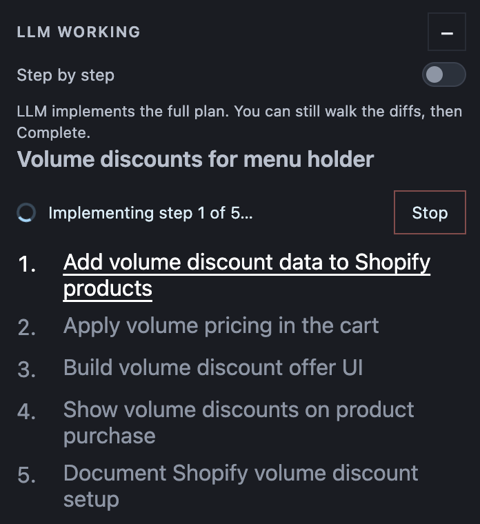

<p align="center">
  <picture>
    <source media="(prefers-color-scheme: dark)" srcset="docs/inbase-logo-white.png" />
    
  </picture>
</p>

A first-person 3D map of a codebase. Files become blocks, folders become walkable areas, and imports become lines in the air.

<p align="center">
  
  &nbsp;&nbsp;&nbsp;
  
</p>

Install the package in a project, run `inbase init`, then `inbase run`. Cursor’s LLM then plans and patches through the visual map instead of editing files directly.

The npm package is `@jkwd/inbase` (npm blocks the unscoped name `inbase`). The command is still `inbase`.

## Use in a project

```bash
npm install -D @jkwd/inbase
npx inbase init
npx inbase run
```

Or install globally:

```bash
npm install -g @jkwd/inbase
inbase init
inbase run
```

Open the printed URL (http://localhost:5173 by default), click the scene, then walk with WASD.

`inbase run` maps the current directory. To map another folder:

```bash
inbase run --target /path/to/your/project
```

`inbase init` copies a Cursor skill into `.cursor/skills/inbase/` and gitignores `.inbase/`. Keep `inbase run` open, then ask Cursor to change source files — the LLM follows the visual plan and patch loop described below.

## LLM integration



Inbase does not call a model itself. The visual coding loop currently supports **Cursor**. The installed skill makes the agent work through the map: it reports a plan, waits on the **HUD** (heads-up display — the overlay panel on the 3D map), edits live files for each invoked step, and records that step as a patch. Those stored patches are the session record and are applied on every step update.

`npx inbase run` opens 5 empty chat slots on the map. Open a regular Cursor chat to connect — it takes the next unconnected slot. You can type an **initial instruction**, drop **context files**, and place a **blueprint** (right-click the map to create files and folders) on a waiting slot before or after that chat connects. The layout is the source of truth for the chat. Dropped context files stay with that session until it ends. The **global** (blue) blueprint is shared across sessions; each session color also has a **local** blueprint that only that chat sees. Both stay on the map even after those files and folders exist. Use the color chips to choose which blueprint you are editing, then **Hide**, **Clear**, or **Cleanup** (drops planned items that already exist). When a session finishes it is discarded and a new empty slot is opened; the global blueprint remains. Restarting the visualizer discards leftover sessions and opens 5 new empty slots.

A normal chat request connects to the next empty slot. Use `/coral add a login page` (or `/red`, `/amber`, `/lime`, `/orange`, `/violet`) to connect to that color's slot. `/blue` is the global blueprint, not a chat. Use `/go` to start a proposal, `/accept` to accept it, and `/explain How does login work?` while the map is open to jump into **explain mode**. If a plan or proposal is waiting, `/explain` explains that proposal (add a question for extra focus). Click the **?** next to a file or folder name to have the LLM explain that path and where it fits. The HUD hides, an X exits, and the LLM publishes the explanation; you step through it in the overlay. Each step can dim the rest of the map to 50% opacity, click a block to show import relations, and zoom into a folder. **Ask question** on the current step drills into sub-steps (`7.1`, `7.2`) until you return to the next original step. A step can also open the file **info panel**, highlight functions and vars, and draw an arrow that points at a symbol. Use `/skipinbase [request]` to work outside the map. If Inbase is not running, start it with `npx inbase run`. Only 5 chats can be connected at once. `wait-for-blueprint` only reads the optional blueprint, instruction, and attached files.

If several slots are waiting, the next Cursor chat attaches the oldest empty session. Sessions that already have an LLM are skipped, and the map window does not need to be focused.

With **Step by step** on, type `/go` in Cursor to start a step, then `/accept` when the patch is ready. `/explain` (optionally with a question) has the LLM publish an explanation you step through on the map. With Step by step off, the LLM implements the full plan; you can still walk Previous/Next over the diffs, then `/accept`. Send an alternative instruction from the HUD to update the current proposal, or **Stop** to end the session.

When no LLM is currently making changes, turn on **Show branch changes** (or press **G**) to highlight the current git branch against its base — committed, unstaged, and untracked files — instead of LLM patch files. The control is disabled while an LLM session is writing or reviewing a patch.

The LLM edits project files after a step is invoked. Inbase records those edits
as a patch against the snapshot taken at invoke. Those stored patches are the
session record and are applied on every step update.

<br clear="all" />

## Commands

| Command | What it does |
| --- | --- |
| `inbase init` | Install the Cursor skill in this repo |
| `inbase run` | Scan this repo and start the local map |
| `inbase run --port 5174` | Start on another port |
| `inbase go [--session <id>]` | Invoke the waiting plan step (`/go`) |
| `inbase accept [--session <id>]` | Accept the current proposal (`/accept`) |
| `inbase explain start [--question "..."]` | Open map-only explain mode |
| `inbase explain report --step "..."` | Publish explanation steps and map focus |
| `inbase explain wait` | Wait for a question on a step, or until explain mode exits |
| `inbase explain stop` | Exit explain mode |

Session commands (`attach`, `wait-for-blueprint`, `report-plan`, `wait-for-approval`, `go`, `accept`, `propose-patch`, `explain`) are used by the Cursor skill. You do not need to run them yourself.

## Editor support

The map runs in the browser. The LLM plan and patch loop currently works in **Cursor** only (`inbase init` installs a skill into `.cursor/skills/inbase/`).

## Language support

Every text file in the project becomes a block. JavaScript and TypeScript (`.ts`, `.tsx`, `.js`, `.jsx`, `.mjs`, `.cjs`) also get **functions**, **classes**, and **variables**. Relative `import` / `require()` specifiers become edges when they resolve — including `.astro` and other JS-style modules. Package names like `react` or `@angular/core` do not. Binary files are skipped.

## How to read the map

- Each **file** is a block. Taller blocks have more lines of code.
- Small cubes on a block are **functions** (blue) and **variables** (tan).
- Each **folder** is a floor area with a center walkway.
- At the far end of an area, **bridges** lead into child folders. The folder name hangs above the bridge.
- Click a block to see **import relations**. Connected files stay lit and arcs draw to them.

## Develop Inbase itself

This repository is a workspace. The bundled demo target is `apps/example-target`.

```bash
npm install
npm run dev
```

That still maps `apps/example-target` by default. In the map, **Look at** switches to the complete repository (and later example apps). That control is only in `npm run dev`, not `inbase run`.

To map a different project without the CLI:

```bash
VISUAL_CODER_TARGET=/path/to/your/project npm run dev
```

To run the example React app itself:

```bash
npm run dev:target
```

## Contributing

Issues and pull requests are welcome. See [CONTRIBUTING.md](CONTRIBUTING.md).

## License

Inbase is open source under the [MIT License](LICENSE).
