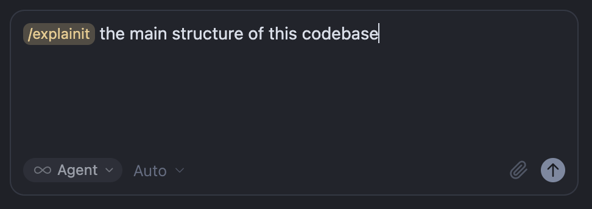
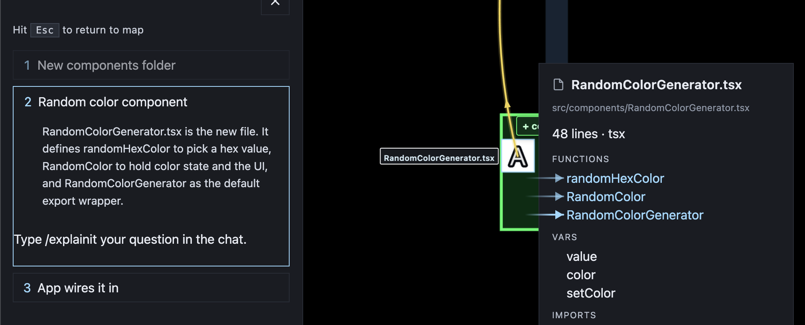

# Explain mode

Explain mode walks a question on the map. It does not edit project files or start the next plan step.

**From a question**

Type `/explainit` with a question while the map is open — for example the main structure of the codebase:

The HUD hides and an **X** exits. The LLM publishes an explanation you step through in the overlay. Each step can focus a folder or file on the map:

A later step can open the file **info panel**, highlight functions and vars, and draw arrows to the symbols it names:

