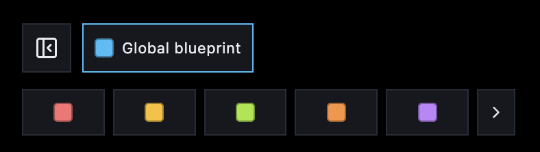
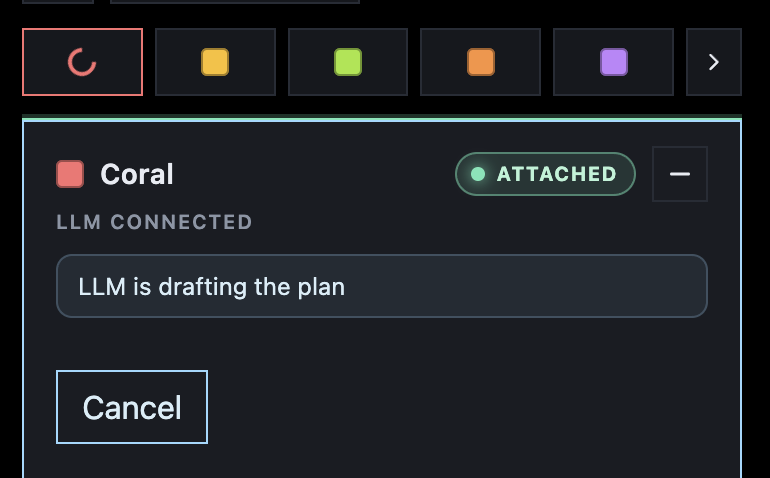
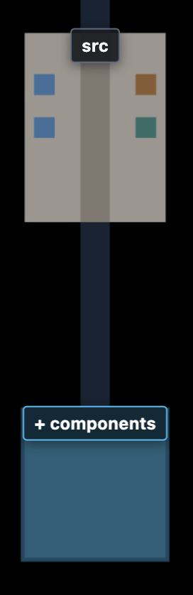
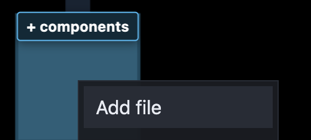
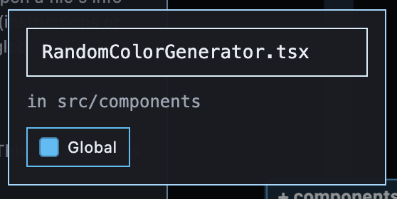
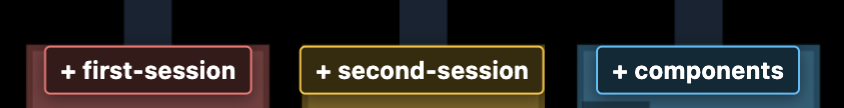

# LLM interaction

## Sessions and colors

`npx inbase run` opens **10 empty chat slots** on the map. Each slot has a color.

| Color | Command | Alias |
| --- | --- | --- |
| Coral | `/coral` | `/red` |
| Amber | `/amber` | `/yellow` |
| Lime | `/lime` | `/green` |
| Orange | `/orange` | |
| Violet | `/violet` | `/purple` |
| Teal | `/teal` | |
| Crimson | `/crimson` | |
| Forest | `/forest` | `/darkgreen` |
| Grey | `/grey` | `/gray` |
| White | `/white` | |

Connect a regular chat by starting with a color command and your request:

That attaches the chat to that color’s empty slot — Coral in the example above.

If you skip the command and only send the request, Inbase attaches the **first available** color instead:

When a chat is attached, the map opens that color’s **LLM session window**. Look for **ATTACHED** / **LLM CONNECTED** and the current status (for example “LLM is drafting the plan”):

There is no `/blue` command: blue is not a chat slot. It is the **global blueprint**, shared by every LLM session — covered in the next section.

## Drawing a blueprint

You draw a blueprint **on top of the map** — the spatial plan the LLM must follow. Place it before a chat connects, or keep adding after the chat has attached.

Pick a session color in the row above the session window to draw on that color’s local blueprint. **Global blueprint** (next to the fold-in control) draws on the shared blue layer and hides the session window. Hide, Clear, and Cleanup apply to the active color.

### Add folders

Right-click a folder on the map and choose **Add folder**. For example, plan a `components` folder under `src`:

1. Open the context menu and choose **Add folder**:

2. Enter the name and choose which blueprint it belongs to — **Global** or a session color:

3. The planned folder appears on the map (blue when it is on the global blueprint):

### Add files

Right-click a folder and choose **Add file**. For example, `RandomColorGenerator.tsx` inside `components`:

1. Open the context menu and choose **Add file**:

2. Enter the file name (it is created in that folder on the active blueprint):

3. The file block appears on the map. Click it to open the **info panel**:

### Add function and vars

In the info panel, add the **functions** and **vars** the file should contain. Type a name and click **Add** — the LLM treats those symbols as part of the blueprint:

You can also add **imports**, or a note on a symbol for extra instructions or pseudo code.

### File notes

Use a **file note** for free-form instructions the LLM should follow for that file. In the info panel, click **Add file note**:

Write what the file should do, then close the note:

### Session specific blueprint

**Blue** is always the **global** blueprint — every LLM session sees it. The other colors are **session-specific**: only the chat attached to that color receives that layer.

When you add a folder or file, pick **Global** or a session color at the bottom of the dialog:

Planned items take that color on the map. Here `components` is global (blue) and `session-specific` belongs to Coral (red):

Left to right: the first folder is local to `/coral`, the second is local to `/amber`, and the blue folder is the **global** blueprint — shared with both LLM sessions.
